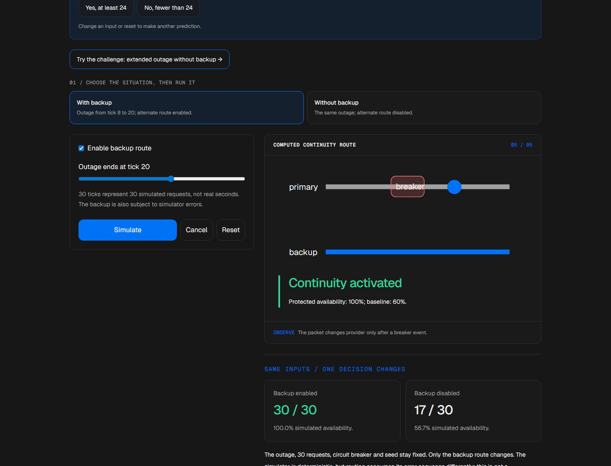
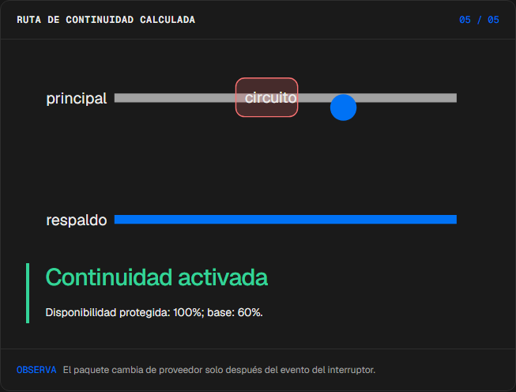
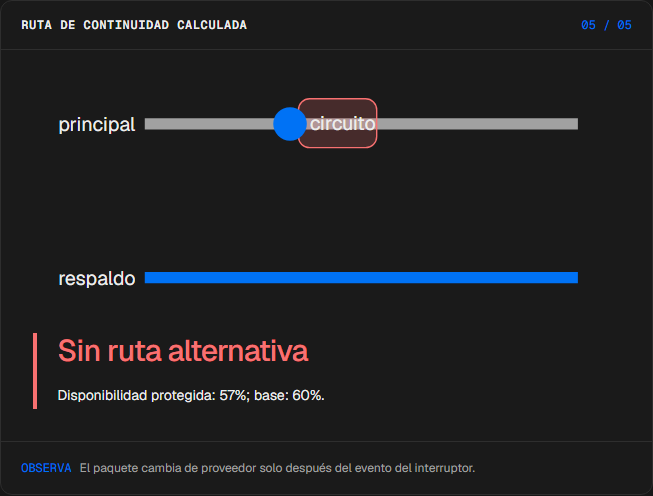
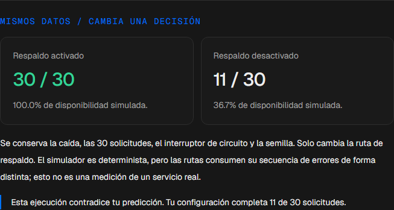
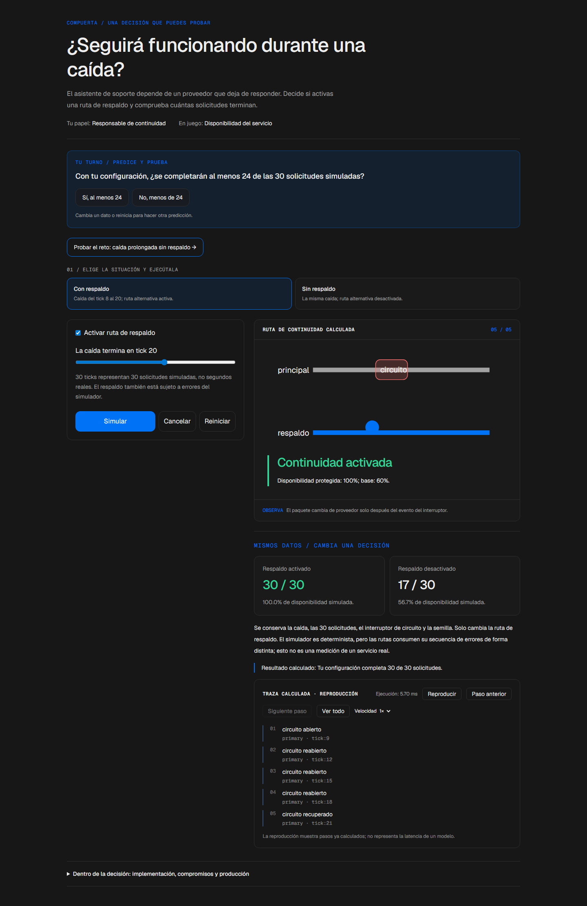

# Compuerta

<!-- community-badges -->
[](https://github.com/mdeasis27/compuerta/actions/workflows/ci.yml) [](LICENSE)
<!-- /community-badges -->

[English](README.md) · [Probar demo](https://compuerta-manueldeasis27-2515s-projects.vercel.app/es/app) · [Caso de estudio](https://manueldeasis.com/es/projects/compuerta) · [Código](https://github.com/mdeasis27/compuerta)



Cambia una ventana de falla, carga y política de rutas para comparar disponibilidad.

## Dos situaciones para comparar

**Failover activado:** Caída principal de tick 8 a 20; respaldo activado, hedging desactivado. El tráfico puede redirigirse tras eventos de breaker.



**Failover desactivado:** Misma caída de tick 8 a 20; respaldo desactivado. La disponibilidad sigue solo la ruta principal.



## Caso de uso de negocio

Una caída del proveedor principal deja tráfico sin una decisión explícita de enrutamiento.

**Quién lo usa:** Responsable de continuidad de servicio.

**La decisión:** Activar enrutamiento de continuidad o depender de la ruta principal.

Elige failover activado o desactivado, simula eventos de breaker e inspecciona la ruta seleccionada.

### Prueba la decisión

**Failover activado:** Caída principal de tick 8 a 20; respaldo activado, hedging desactivado. El tráfico puede redirigirse tras eventos de breaker.

**Failover desactivado:** Misma caída de tick 8 a 20; respaldo desactivado. La disponibilidad sigue solo la ruta principal.

Elige un escenario, modifica sus controles y ejecuta el cálculo local. Avanza por la visualización paso a paso o revela todo. Reinicia antes de comparar el segundo escenario.

## Cómo probarlo

Abre `/en/app` (inglés, por defecto) o `/es/app` (español). Cambia los datos del escenario y ejecuta el cálculo. Inspecciona la decisión, evidencia y traza calculada. La reproducción revela pasos locales ya completados; no mide un modelo en vivo. Reiniciar empieza un escenario local nuevo. Cambiar de idioma reinicia el escenario.

La demo principal no requiere cuenta, clave de API ni base de datos. Los enlaces públicos apuntan al despliegue existente; el rediseño local está pendiente de publicación.

<!-- recruiter-mission:start -->
### Tu misión interactiva

Prueba una caída prolongada sin respaldo, predice si se completarán 24 de 30 solicitudes, simula y revela la traza completa.

Compara el respaldo activado y desactivado con la misma caída, interruptor de circuito y semilla. Cada ruta consume de forma distinta la secuencia de errores. Es una simulación controlada, no disponibilidad real de un servicio.

**Por qué este enfoque:** La máquina de estados del interruptor de circuito hace inspeccionables los fallos y la recuperación. El respaldo puede preservar continuidad, pero añade límites de capacidad y riesgo de fallos correlacionados.

**Antes de producción:** Validar errores correlacionados, tiempos de espera, límites de capacidad, observabilidad y recuperación con pruebas de carga e incidentes. Los campos monetarios del simulador y API usan centavos enteros explícitos: cada llamada exitosa y de cobertura se redondea una vez hacia arriba; los intentos fallidos no se cobran. Son supuestos de facturación ilustrativos.

Editar datos, elegir un escenario o reiniciar borra la predicción y los resultados anteriores. La comparación aparece al completar la reproducción; las demos principales no requieren cuenta ni llave.

El piloto de misiones actualiza esta implementación. Las capturas e informes de navegador existentes documentan la etapa anterior; las comprobaciones de interacción y capturas nuevas están pendientes por bloqueos del entorno actual.

<!-- recruiter-mission:end -->

## Instalación y verificación local

Requiere Node.js 22 y pnpm 10.

```sh
pnpm install --frozen-lockfile
pnpm dev
pnpm test
node node_modules/typescript/bin/tsc --noEmit --incremental false
pnpm lint
pnpm build
```

Abre `http://localhost:3000/en/app`. La validación registrada cubre pruebas, lint, TypeScript y builds de producción. Consulta los [resultados de comandos](docs/quality/decision-lab-verification.json) y las [comprobaciones de componentes en navegador](docs/quality/decision-lab-browser.json). Estas pruebas usan componentes React y CSS de producción con navegación de idioma controlada; no certifican rutas de Next ni el despliegue público.

## Arquitectura

- `app/[lang]/`: experiencia web por idioma.
- `lib/experience/`: adaptador local tipado, validación y trazas.
- `design-system/`: tokens visuales, controles de idioma y presentación de ejecución y reproducción.
- `app/api/`: integraciones opcionales de servidor; la demo principal no las requiere.

Tecnología: Next.js 16, TypeScript, Python, Vitest, pytest, Tailwind CSS v4.

## Evidencia y límites

El tráfico pasa por un breaker hacia carriles principal o alterno.

Carriles de solicitudes y transiciones de circuit breaker en ticks simulados, no solicitudes reales.

Muestra la consecuencia operativa de la configuración antes de un simulacro de caída.

**Límites:** Los eventos de caída y rutas son simulaciones locales, no señales de salud del proveedor. Estos prototipos de portafolio no afirman impacto medido en producción.

Los datos son ejemplos ficticios o anónimos. Las integraciones opcionales requieren sus propias credenciales y configuración. Los secretos pertenecen al gestor configurado, nunca a archivos locales de secretos ni Git. Usa el flujo existente `infisical run -- <command>` si necesitas integraciones en vivo. La demo local no publica ni despliega automáticamente.



<!-- community-section -->
## Licencia y contribución

Publicado bajo la [licencia MIT](LICENSE). Se aceptan issues y pull requests: lee antes [CONTRIBUTING.md](CONTRIBUTING.md) y el [Código de Conducta](CODE_OF_CONDUCT.md). Para reportar una vulnerabilidad, consulta [SECURITY.md](SECURITY.md).
<!-- /community-section -->
