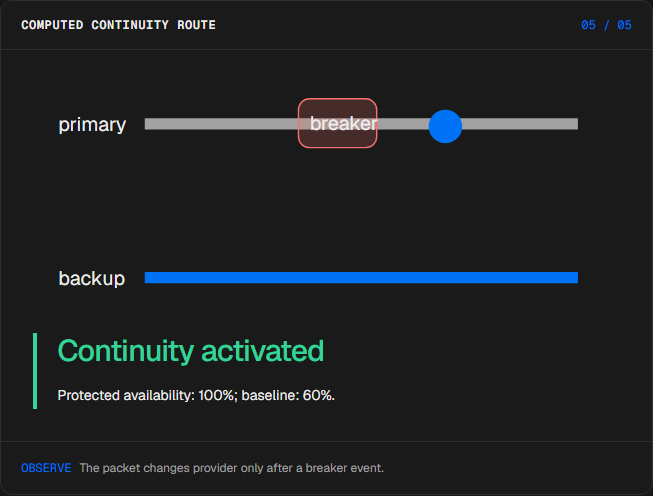
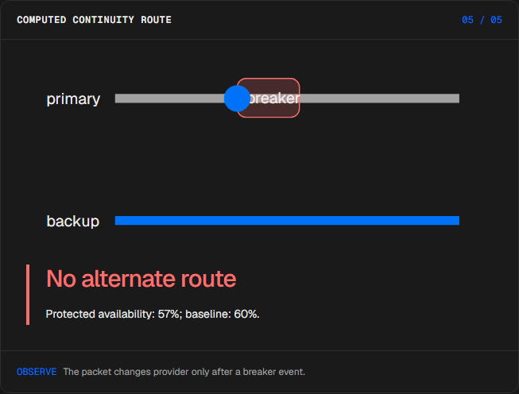
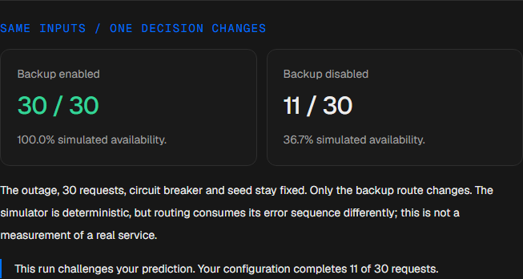
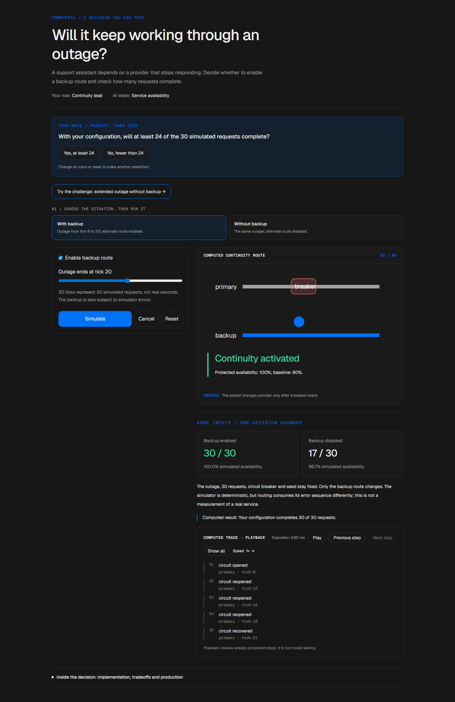

# Resilient routing

<!-- community-badges -->
[](https://github.com/mdeasis27/compuerta/actions/workflows/ci.yml) [](LICENSE)
<!-- /community-badges -->

[Español](README.es.md) · [Try the demo](https://compuerta-manueldeasis27-2515s-projects.vercel.app/en/app) · [Case study](https://manueldeasis.com/en/projects/compuerta) · [Source](https://github.com/mdeasis27/compuerta)


Change an outage window, workload and routing policy to compare availability.

## Two situations to compare

**Failover enabled:** Primary outage from tick 8 to 20; fallback enabled, hedging disabled. Traffic can reroute after breaker events.



**Failover disabled:** Same outage from tick 8 to 20; fallback disabled. Availability follows only the primary path.



## Business use case

A primary provider outage leaves traffic without an explicit routing decision.

**Who uses it:** Service continuity owner.

**The decision:** Enable continuity routing or rely on the primary path.

Choose failover on or off, simulate breaker events, then inspect the route selected for traffic.

### Try the decision

**Failover enabled:** Primary outage from tick 8 to 20; fallback enabled, hedging disabled. Traffic can reroute after breaker events.

**Failover disabled:** Same outage from tick 8 to 20; fallback disabled. Availability follows only the primary path.

Choose a scenario, edit its controls and run the local computation. Step through the visual process or reveal all steps. Reset before comparing the second scenario.

## How to try it

Open `/en/app` (English, default) or `/es/app` (Spanish). Change the scenario inputs and run the computation. Inspect the resulting decision, evidence and computed trace. Playback reveals completed local steps; it does not measure a live model. Reset starts a new local scenario. Changing language resets the scenario.

The primary demo needs no account, API key or database. Public links refer to the existing deployment; local redesign changes are pending publication.

<!-- recruiter-mission:start -->
### Your interactive mission

Try an extended outage without backup, predict whether 24 of 30 requests will complete, simulate and reveal the full trace.

Compare backup routing on and off under the same outage, circuit breaker and seed. The seeded error sequence is consumed differently by each route. This is a controlled simulation, not real service availability.

**Why this approach:** An explicit circuit-breaker state machine makes failure and recovery inspectable. Backup routing can preserve continuity but introduces capacity and correlated-failure concerns.

**Before production:** Validate correlated failures, timeouts, capacity limits, observability and recovery with load and incident tests. Simulator and API monetary fields now use explicit integer cents, with each successful and hedged call rounded upward once; failed attempts remain unbilled. These are illustrative billing assumptions.

Editing inputs, choosing a preset or resetting clears the prediction and obsolete results. Comparisons appear only at completed playback; the primary demos need no account or key.

The mission pilot updates this implementation. Existing screenshots and browser reports document the previous stage; fresh browser interaction checks and captures are pending because the current environment blocked them.

<!-- recruiter-mission:end -->

## Local setup and verification

Requires Node.js 22 and pnpm 10.

```sh
pnpm install --frozen-lockfile
pnpm dev
pnpm test
node node_modules/typescript/bin/tsc --noEmit --incremental false
pnpm lint
pnpm build
```

Open `http://localhost:3000/en/app`. Recorded validation covers tests, lint, TypeScript and production builds. See [command results](docs/quality/decision-lab-verification.json) and [browser component checks](docs/quality/decision-lab-browser.json). The new browser checks exercise real React components and production CSS with controlled locale navigation; they do not certify Next routes or public deployment.

## Architecture

- `app/[lang]/`: localized browser experience.
- `lib/experience/`: typed local adapter, validation and run traces.
- `design-system/`: shared visual tokens, locale controls and execution/replay presentation.
- `app/api/`: optional server integrations; the primary demo does not require them.

Technology: Next.js 16, TypeScript, Python, Vitest, pytest, Tailwind CSS v4.

## Evidence and limitations

Traffic moves through a breaker toward primary or fallback lanes.

Request lanes and breaker transitions on simulated ticks, not real requests.

Shows the operational consequence of the routing configuration before an outage drill.

**Limits:** The outage and routing events are local simulations, not provider health signals. These portfolio prototypes do not claim measured production impact.

Inputs use fictional or anonymized examples. Optional live integrations require their own credentials and operational setup. Secrets belong in the configured secret manager, never in local secret files or Git. Use the existing `infisical run -- <command>` workflow when live integration is needed. This repository does not publish or deploy automatically as part of the local demo.



<!-- community-section -->
## License and contributing

Released under the [MIT License](LICENSE). Issues and pull requests are welcome: read [CONTRIBUTING.md](CONTRIBUTING.md) and the [Code of Conduct](CODE_OF_CONDUCT.md) first. To report a vulnerability, see [SECURITY.md](SECURITY.md).
<!-- /community-section -->
